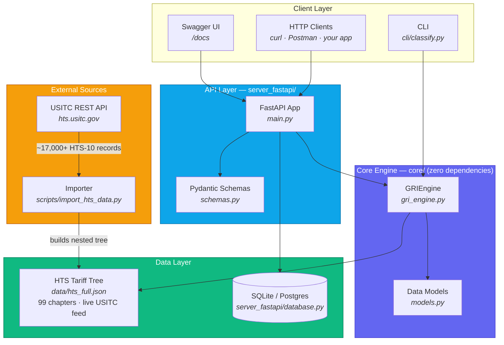
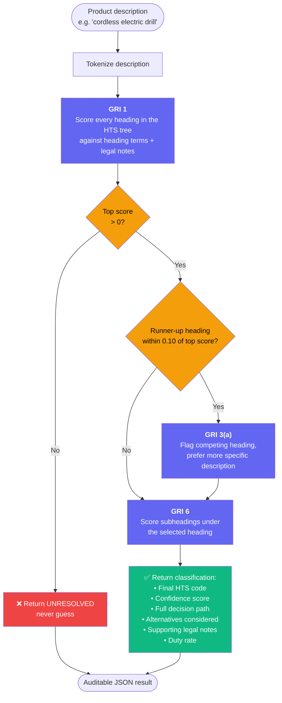
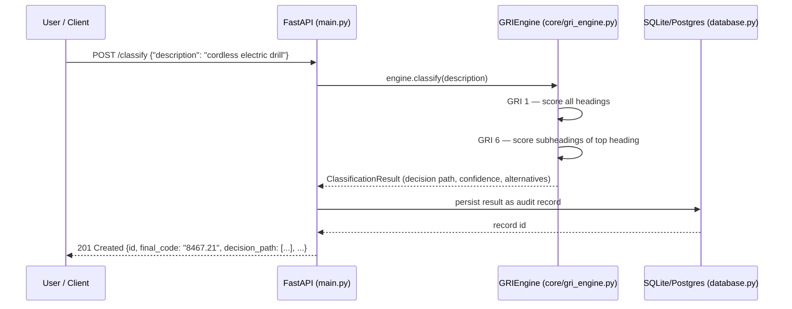
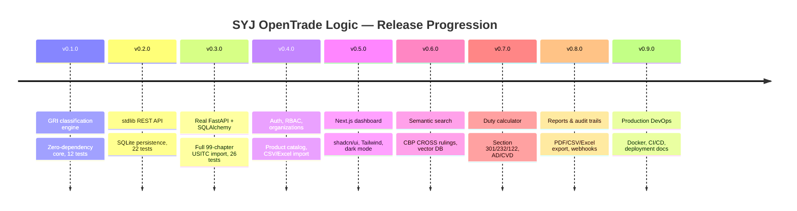

<div align="center">


### The Linux of International Trade Compliance

**An open-source, explainable HTS classification engine and REST API — built to replace black-box AI classifiers with deterministic, auditable trade rules.**

[](./LICENSE)
[](https://www.python.org/)
[](#-testing)
[](./core)
[](#-release-roadmap)
[](https://github.com/SHalimoosavi)

[Quick Start](#-quick-start) · [Architecture](#-architecture) · [How Classification Works](#-how-classification-works) · [API](#-rest-api) · [Roadmap](#-release-roadmap) · [Contributing](#-contributing)

</div>

---

## Why This Exists

Post-2026 tariff volatility turned customs compliance into a weekly operational fire drill. Companies in the **$50M–$500M** revenue band are stuck between two bad options:

| | Enterprise Trade Suites (SAP GTS, Oracle GTM) | Black-Box AI Classifiers |
|---|---|---|
| **Cost** | $250K–$2M+ implementations | Often cheap, sometimes free |
| **Transparency** | Proprietary rule engines | Zero — you can't audit a prediction |
| **Speed to deploy** | 6–18 months | Fast, but you're flying blind |
| **Explainability** | Partial, vendor-locked | None — "trust the model" |

**SYJ OpenTrade Logic takes a third path:** deterministic classification using the actual **General Rules of Interpretation (GRI)** that customs authorities use, with AI permitted only as an *assistant* — never as the decision-maker. Every classification returns a full, human-readable decision path. Nothing is a guess dressed up as a percentage.

> 📖 **On honesty as a design principle:** this README documents exactly what has been built and verified, release by release. Nothing below is aspirational copy for unwritten code — see [Release Roadmap](#-release-roadmap) for what's real today versus what's planned.

---

## 🏗 Architecture



**Design principle:** the core engine (`core/`) has **zero third-party dependencies** and doesn't know or care whether it's called from a CLI, a stdlib HTTP server, or FastAPI. This is deliberate — classification logic should outlive any particular web framework choice.

---

## 🧠 How Classification Works

Classification follows the **General Rules of Interpretation (GRI)** as a Directed Acyclic Graph traversal — not a black-box model call.



**Key engineering decision:** real HTS heading text is terse legal language ("Automatic data processing machines and units thereof") that rarely contains the everyday words a user types ("laptop"). Those live at the subheading level. The engine's `_effective_heading_score()` scores each heading by the *better* of its own text or its best-matching child subheading — otherwise correct classifications would silently fail once real USITC data replaced hand-curated samples. This was a real bug, found and fixed during v0.3.0 development, and is permanently covered by `tests/test_importer_and_terse_headings.py`.

### Example: a request end-to-end



---

## 🚀 Quick Start

### Option A — Zero-dependency core (works anywhere, including Termux)

```bash
git clone https://github.com/SHalimoosavi/SYJ-OpenTrade-Logic.git
cd SYJ-OpenTrade-Logic/syj-opentrade-logic

python3 -m unittest tests.test_gri_engine -v
python3 cli/classify.py "cordless electric drill"
python3 cli/classify.py "cotton t-shirt" --json
```

### Option B — Full REST API (FastAPI + SQLAlchemy)

```bash
pip install -r server_fastapi/requirements.txt --break-system-packages
pip install httpx --break-system-packages   # for TestClient

# Pull the real, full 99-chapter HTS dataset from the official USITC API
python3 scripts/import_hts_data.py

# Run the full test suite
python3 -m unittest tests.test_gri_engine tests.test_api tests.test_importer_and_terse_headings -v
python3 -m unittest server_fastapi.test_main -v

# Launch the live server
python3 -m uvicorn server_fastapi.main:app --reload --port 8000
```

Open **`http://localhost:8000/docs`** for a live, auto-generated Swagger UI.

```bash
curl -X POST http://localhost:8000/classify \
  -H "Content-Type: application/json" \
  -d '{"description": "cordless electric drill"}'
```

---

## 📦 Project Layout

```
syj-opentrade-logic/
├── core/                    # Zero-dependency classification engine
│   ├── models.py            #   HTS tree + result dataclasses
│   └── gri_engine.py        #   GRI 1 / 3(a) / 6 DAG traversal
├── cli/
│   └── classify.py          # Standalone CLI, no dependencies
├── server/                  # v0.2.0 — stdlib http.server REST layer
│   ├── app.py
│   ├── db.py                #   raw sqlite3 persistence
│   └── openapi_spec.py      #   hand-written OpenAPI doc
├── server_fastapi/          # v0.3.0 — real FastAPI + SQLAlchemy
│   ├── main.py               #   route-for-route port of server/app.py
│   ├── database.py           #   SQLAlchemy models (SQLite by default, Postgres-ready)
│   ├── schemas.py            #   Pydantic request/response contracts
│   └── test_main.py          #   FastAPI TestClient integration tests
├── scripts/
│   └── import_hts_data.py   # Pulls full 99-chapter HTS from the live USITC API
├── data/
│   ├── hts_sample.json      # Small demo dataset (laptops, t-shirts, drills, phones)
│   └── hts_full.json        # Generated by the importer — not committed, ~17k+ records
├── tests/
│   ├── test_gri_engine.py
│   ├── test_api.py
│   └── test_importer_and_terse_headings.py
├── LICENSE                  # Apache 2.0
└── README.md
```

---

## 🌐 REST API

| Method | Path | Purpose |
|---|---|---|
| `GET` | `/health` | Liveness check |
| `POST` | `/classify` | Classify a product description, persist the result |
| `GET` | `/classifications?limit=&offset=` | Paginated classification history |
| `GET` | `/classifications/{id}` | Fetch one classification record |
| `DELETE` | `/classifications/{id}` | Delete one classification record |
| `GET` | `/docs` | Interactive Swagger UI (auto-generated by FastAPI) |
| `GET` | `/openapi.json` | Machine-readable OpenAPI 3.0 spec |

<details>
<summary><b>Example response — <code>POST /classify</code></b></summary>

```json
{
  "id": 1,
  "product_description": "cordless electric drill",
  "final_code": "8467.21",
  "final_description": "Drills of all kinds, hand-held, electric motor",
  "confidence": 0.87,
  "is_classified": true,
  "duty_rate": "1.7%",
  "decision_path": [
    {
      "node_code": "8467",
      "node_description": "Tools for working in the hand...",
      "rule_applied": "GRI 1",
      "reasoning": "Heading 8467 scored highest (0.82) against the terms of the heading, per GRI 1...",
      "score": 0.82
    },
    {
      "node_code": "8467.21",
      "node_description": "Drills of all kinds, hand-held, electric motor",
      "rule_applied": "GRI 6",
      "reasoning": "Subheading 8467.21 scored highest (0.91) among subheadings of 8467, per GRI 6...",
      "score": 0.91
    }
  ],
  "alternatives": [],
  "supporting_notes": []
}
```

</details>

---

## 🤖 Why Deterministic, Not AI-First

> AI should **assist** — cleaning descriptions, extracting attributes, summarizing rulings, suggesting candidates for a human to review. AI must **never replace** deterministic GRI-based classification.

This isn't a limitation — it's the whole point. A customs broker who gets asked *"why did the system pick this code?"* needs an answer rooted in the actual legal text of the tariff schedule, not a confidence score from an opaque model. Every result this engine returns can be defended in an audit.

---

## 🗺 Release Roadmap



| Release | Scope | Status |
|---|---|---|
| **v0.1.0** | GRI classification engine | ✅ Done — 12 tests passing |
| **v0.2.0** | stdlib REST API + SQLite persistence | ✅ Done — 22 tests passing |
| **v0.3.0** | Real FastAPI + SQLAlchemy; full 99-chapter HTS import | ✅ Done — 26 tests passing, live against USITC data |
| **v0.4.0** | Auth (JWT/RBAC), organizations, product catalog, CSV/Excel import | 🔜 Planned — needs Postgres |
| **v0.5.0** | Vite+React dashboard (shadcn/Tailwind) — swapped from Next.js for Termux/mobile practicality | ✅ Code complete, import/export/syntax-verified by script; `npm install` + real run needed on your machine |
| **v0.6.0** | Semantic search over CBP CROSS rulings (vector DB) | 🔜 Planned — needs Pinecone/Milvus + embeddings API |
| **v0.7.0** | Duty calculator, Section 301/232/122, AD/CVD tariff library | 🔜 Planned — needs tariff data sources |
| **v0.8.0** | Reports (PDF/CSV/Excel), audit trails, webhooks | 🔜 Planned |
| **v0.9.0** | Docker/Compose, GitHub Actions CI/CD, deployment docs | 🔜 Planned |

---

## 🧪 Testing

```bash
# Core engine + stdlib API (no extra deps required)
python3 -m unittest tests.test_gri_engine tests.test_api tests.test_importer_and_terse_headings -v

# FastAPI layer (requires server_fastapi/requirements.txt + httpx)
python3 -m unittest server_fastapi.test_main -v
```

**26 tests, all passing**, covering: correct GRI-based classification, refusal to guess on unmatched products, decision-path integrity, live HTTP integration against a real running server, direct SQLite file verification (bypassing the API to prove persistence isn't mocked), and the real-data chapter-detection regression found while importing the live USITC feed.

---

## 🤝 Contributing

This project is built in the open, in public, with every bug and fix documented rather than hidden. Issues and PRs welcome once the repository is public-ready for external contributors (tracked for v0.9.0 alongside CI/CD). Until then, feel free to open issues for bugs or design discussion.

## 📄 License

Apache 2.0 — see [`LICENSE`](./LICENSE).

---

<div align="center">
<sub>Built by <a href="https://github.com/SHalimoosavi">Sayanjali Nexus Private Limited</a> · Hyderabad, India</sub>
</div>
